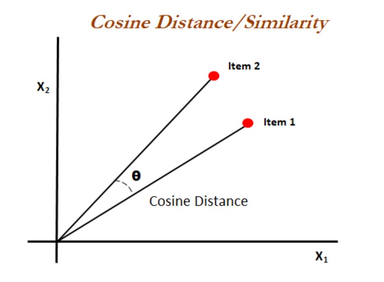
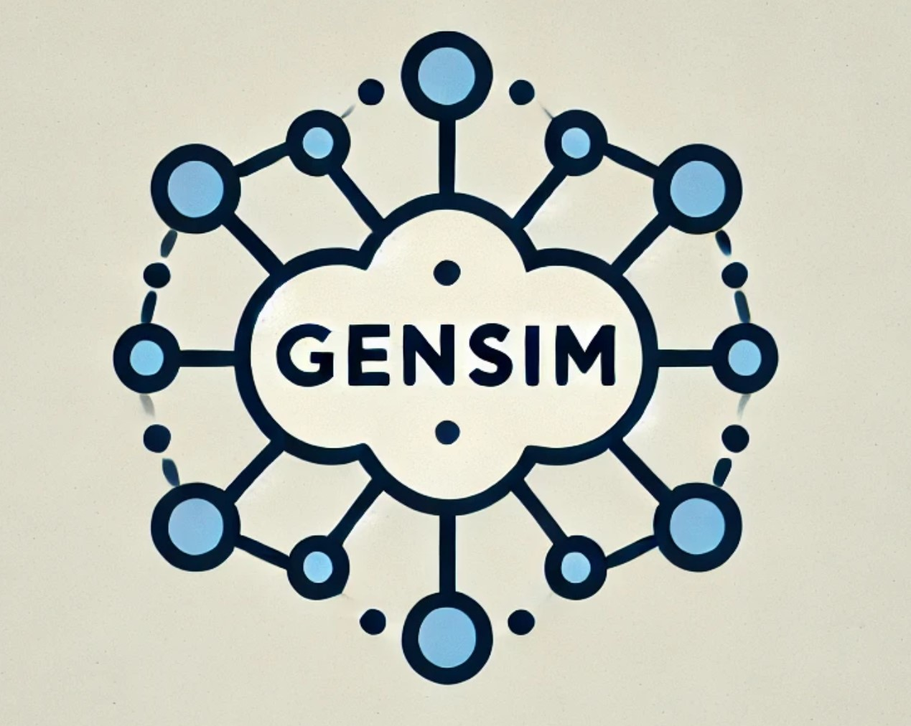
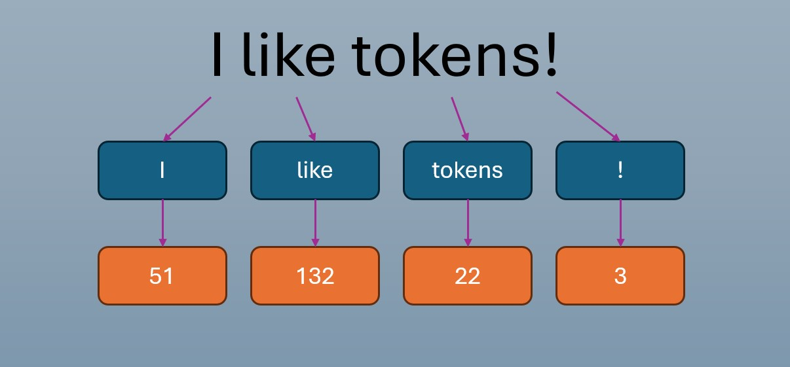
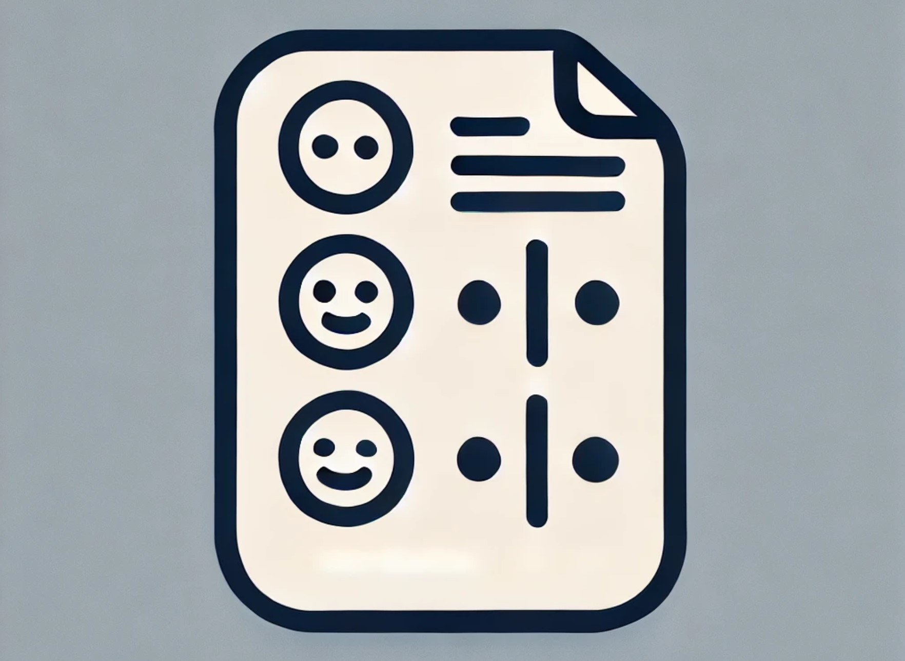

# Desafíos de NLP

- **Carrera de Especialización en Inteligencia Artificial**
- **Materia**: Procesamiento del Lenguaje Natural
- **Alumno**: Simón Rodríguez

A continuación se presentan los desafíos de código realizados para la materia "Procesamiento del Lenguaje Natural" en el marco de la Carrera de Especialización en Inteligencia Artificial de la Universidad de Buenos Aires.

## Desafío 1: Vectorización de Texto

### Resumen de la Consigna
El desafío consiste en trabajar con el dataset "20 newsgroups" y aplicar técnicas de vectorización de texto (como el conteo de palabras y TF-IDF) para crear modelos de clasificación basados en Naïve Bayes. Los principales objetivos son:

1. Vectorizar documentos y analizar la similaridad entre ellos.
2. Entrenar modelos de clasificación Naïve Bayes (Multinomial y ComplementNB) y ajustar los parámetros para maximizar el f1-score en la clasificación.
3. Transponer la matriz de términos y analizar la similaridad entre palabras.

### Resultados
- Se logró calcular la similaridad entre documentos utilizando técnicas de vectorización, identificando los documentos más cercanos en términos de contenido.
- El modelo Naïve Bayes Multinomial, ajustado con distintos parámetros, mostró un buen desempeño en la clasificación de textos, alcanzando un f1-score macro satisfactorio en el conjunto de prueba.
- Al transponer la matriz de términos, se realizó un análisis de la similaridad entre palabras, lo que permitió identificar relaciones semánticas interesantes entre términos del corpus.

Link: [Notebook del Desafío 1](../desafios/desafios/Desafio_1_Vectorizacion_de_texto.ipynb)

## Desafío 2: Custom Embeddings con Gensim

### Resumen de la Consigna
En este desafío, se busca crear vectores de palabras personalizados (embeddings) utilizando la librería Gensim. El objetivo es generar embeddings basados en dos corpus literarios: "Las Aventuras de Sherlock Holmes" de Arthur Conan Doyle y "El Arte de la Guerra" de Sun Tzu. Se busca comparar cómo las palabras se representan en el espacio de embeddings según el uso particular de los autores.

Los pasos clave incluyen:

1. Preprocesar los textos.
2. Entrenar modelos de Word2Vec para generar los embeddings.
3. Evaluar las similitudes entre palabras y graficar los resultados.

### Resultados
Se generaron embeddings para ambos libros. A través de la evaluación de términos clave, se pudo observar cómo las palabras relacionadas con la guerra en "El Arte de la Guerra" se agrupan de manera diferente que en "Las Aventuras de Sherlock Holmes", reflejando los distintos temas y estilos de cada autor.

Link: [Notebook del Desafío 2](../desafios/desafios/Desafio_2_Custom_embeddings_Gensim.ipynb)

## Desafío 3: Modelo con Tokenización por Caracteres y Palabras

### Resumen de la Consigna
Este desafío está dividido en dos partes y busca construir modelos de lenguaje utilizando dos enfoques de tokenización: a nivel de caracteres y a nivel de palabras. En ambos casos, se trabaja con el corpus de "Viaje al Centro de la Tierra" de Julio Verne. El objetivo es entrenar modelos de redes neuronales recurrentes (RNN, LSTM, GRU) para predecir secuencias de texto, y generar nuevas secuencias mediante estrategias de búsqueda (greedy search, beam search).

### Resultados
**Parte 1: Tokenización por caracteres**

1. Se tokeniza el texto a nivel de caracteres.
2. Se utiliza una arquitectura de red neuronal recurrente (LSTM) para aprender patrones del texto.
3. Se generan secuencias de texto a partir de una secuencia inicial, ajustando los parámetros de búsqueda y temperatura para evaluar el comportamiento del modelo.

Link: [Notebook del Desafío 3 - parte 1](../desafios/desafios/Desafio_3_modelo_lenguaje_char.ipynb)

**Parte 2: Tokenización por palabras**

1. Se tokeniza el texto a nivel de palabras, lo que implica elegir un tamaño de contexto adecuado.
2. El corpus se organiza en secuencias de entrenamiento y se estructuran los datos para realizar predicciones many-to-many, donde el modelo predice la palabra siguiente en una secuencia dada.
3. Se utilizan LSTM y GRU para modelar el lenguaje, y se experimenta con estrategias de generación de texto, observando cómo afecta la calidad del texto generado.

Link: [Notebook del Desafío 3 - parte 2](../desafios/desafios/Desafio_3_modelo_lenguaje_word.ipynb)

## Desafío 4: Bot QA

### Resumen de la Consigna
El objetivo de este desafío es construir un chatbot basado en LSTM que pueda responder preguntas (QA) utilizando datos del desafío ConvAI2 (Conversational Intelligence Challenge 2). El enfoque se centra en desarrollar un modelo de tipo encoder-decoder para comprender y generar respuestas.

### Resultados
El modelo fue entrenado exitosamente, pero durante las pruebas de inferencia se observó que el chatbot tendía a generar respuestas repetitivas como "I am vegan" en distintos contextos. A pesar de ajustar algunos parámetros, el comportamiento no varió significativamente.

Link: [Notebook del Desafío 4](../desafios/desafios/Desafio_4_bot_qa.ipynb)

## Desafío 5: Bert - Análisis de Sentimientos Multicategórico

### Resumen de la Consigna
El objetivo de este desafío es realizar un análisis de sentimientos multicategorial utilizando el modelo preentrenado BERT (Bidirectional Encoder Representations from Transformers). Se emplea un conjunto de datos con reseñas de aplicaciones de Google Apps para entrenar un modelo que clasifique las reseñas en varias categorías de sentimiento.

### Resultados
El modelo BERT fue ajustado para realizar la clasificación de sentimientos, además de un proceso de fine-tuning.

Los pasos principales incluyen:

1. Preprocesamiento y limpieza del dataset.
2. Definir y entrenar un modelo de clasificación multicategorial basado en BERT.
3. Afinar el modelo (fine-tuning) para mejorar el rendimiento de la clasificación.

Link: [Notebook del Desafío 5](../desafios/desafios/Desafio_5_bert_sentiment_analysis_multicategorial.ipynb)

## Desafío 6: Presentación en Github de los desafíos.
Este desafío final se trata de presentar los desafíos de código realizados para la materia. Es decir, el resultado de este desafío es la rama "Desafios" de este repositorio.

# ¡Gracias!

Cualquier pregunta, duda o sugerencia es bienvenida.

> English version will come next.